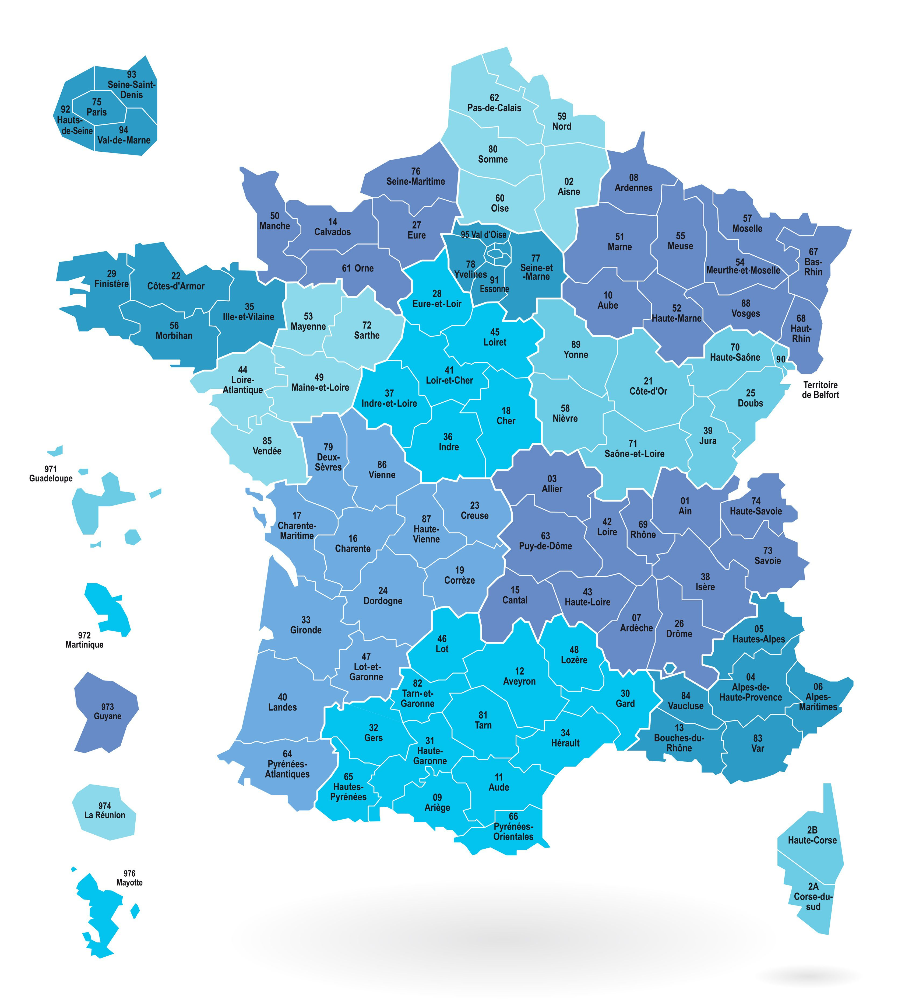

# Bienvenue sur le réseau Pan-Together

!!! warning "Site en construction"   

<strong>PAN-TOGETHER</strong>, le Réseau d’Excellence Clinique pour la prise en charge des cancers du <strong>PAN</strong>créas, des <strong>T</strong>umeurs <strong>O</strong>eso-<strong>G</strong>astriques <strong>E</strong>t des <strong>T</strong>umeurs primitives <strong>HE</strong>pato-biliai<strong>R</strong>es   
  
Les cancers de l’œsophage, du foie, des voies biliaires et du pancréas sont associés à un pronostic défavorable à tous les stades, selon la définition européenne des cancers à mauvais pronostic.    
Le projet de réseau d'excellence clinique **PAN-TOGETHER** vise à structurer la prévention et la prise en soins de ces cancers, essentielle pour améliorer la qualité de la prise en charge globale des patients.

Il est organisé selon une structure arborescente, englobant trois branches principales basées sur les localisations anatomiques ciblées : 

- œsophage et jonction œso-gastrique
- foie et voies biliaires
- pancréas

Chaque branche est supervisée par un centre expert référent, garantissant une 
couverture nationale étendue et homogène. 

## Le réseau
   
Le réseau s’organise autour d’un centre pilote – le CHU de Brest – et du coordonnateur national - le Pr Metges - des trois centres experts chacun référent d'un axe spécifique :   
   
* Axe **Œsophage et Jonction Oeso-Gastrique** : porté par le **CHU de Brest**, sous la coordination du Pr Jean-Philippe Metges et du Dr Vincent Bourbonne.
* Axe **Foie et Voies biliaires** : assuré par le **CHU Avicenne (AP-HP)**, sous la responsabilité du Pr Nathalie Ganne-Carrié et du Pr Pierre Nahon.
* Axe **Pancréas** : confié au **CHU Pitié-Salpêtrière (AP-HP)**, coordonné par le Pr Jean-Baptiste Bachet et le Pr Jean-Philippe Spano.
   
Chaque centre référent pilote le projet à l’échelle nationale en s’appuyant sur des centres experts.
Le réseau compte plus de 52 centres experts métropolitains et ultramarins. Ils ont été sélectionnés selon des critères d'excellence, incluant une file active importante de patients, un accès systématique aux essais cliniques innovants, et une production scientifique reconnue. Ils ont pour rôle de structurer et d’animer le réseau en établissant des conventions de collaboration régionales et/ou inter-régionales avec les centres de proximité, les médecins généralistes et spécialistes, garantissant l'accès à des plateformes diagnostiques et interventionnelles de pointe. Ils permettent la concertation d’experts grâce à l’organisation de RCP spécialisées et veillent à ce que les essais thérapeutiques soient accessibles au plus grand nombre de patients, indépendamment de leur lieu de résidence.
  

## Les missions du réseau   
   
Les objectifs du réseau d'excellence Pan-Together sont de permettre :    

- une harmonisation de l’offre de soins sur le territoire national, conformément aux réglementations en vigueur
- une accélération de la prise en charge du patient, en permettant un accès rapide aux centres ressources  
- une possibilité d’accès aux essais thérapeutiques innovants pour tous les patients sur l’ensemble du territoire 
- une optimisation personnalisée de la prise en charge globale et multi-professionelle du patient, du diagnostic au traitement en passant par les soins de support

      

**PAN-TOGETHER : POUR l’AMELIORATION ENSEMBLE DU PRONOSTIC des cancers digestifs de sombre pronostic**

 
 
 
  Pan-Together est un réseau labellisé par l'Institut National du Cancer 
