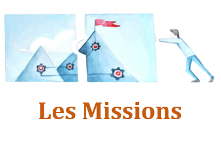

# Bienvenue sur le réseau PAN-TOGETHER

!!! warning "Site en construction"   

<strong>PAN-TOGETHER</strong>, le Réseau d’Excellence Clinique pour la prise en charge des cancers du <strong>PAN</strong>créas, des <strong>T</strong>umeurs <strong>O</strong>eso-<strong>G</strong>astriques <strong>E</strong>t des <strong>T</strong>umeurs primitives <strong>HE</strong>pato-biliai<strong>R</strong>es   
  
Les cancers de l’œsophage, du foie, des voies biliaires et du pancréas sont associés à un pronostic défavorable à tous les stades, selon la définition européenne des cancers à mauvais pronostic.    
Le projet de réseau d'excellence clinique **PAN-TOGETHER** vise à structurer la prévention et la prise en soins de ces cancers, essentielle pour améliorer la qualité de la prise en charge globale des patients.

Il est organisé selon une structure arborescente, englobant trois branches principales basées sur les localisations anatomiques ciblées : 

- œsophage, estomac et jonction œso-gastrique
- foie et voies biliaires
- pancréas

Chaque branche est supervisée par un centre expert référent, garantissant une 
couverture nationale étendue et homogène. 

      

**PAN-TOGETHER : POUR l’AMELIORATION ENSEMBLE DU PRONOSTIC des cancers digestifs de sombre pronostic**

 
 

  

  

    
    
    
    

  

