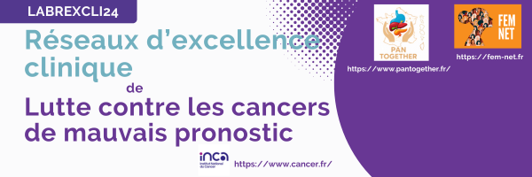
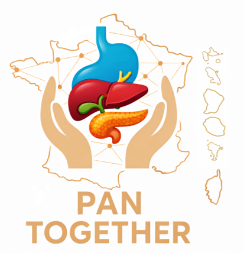
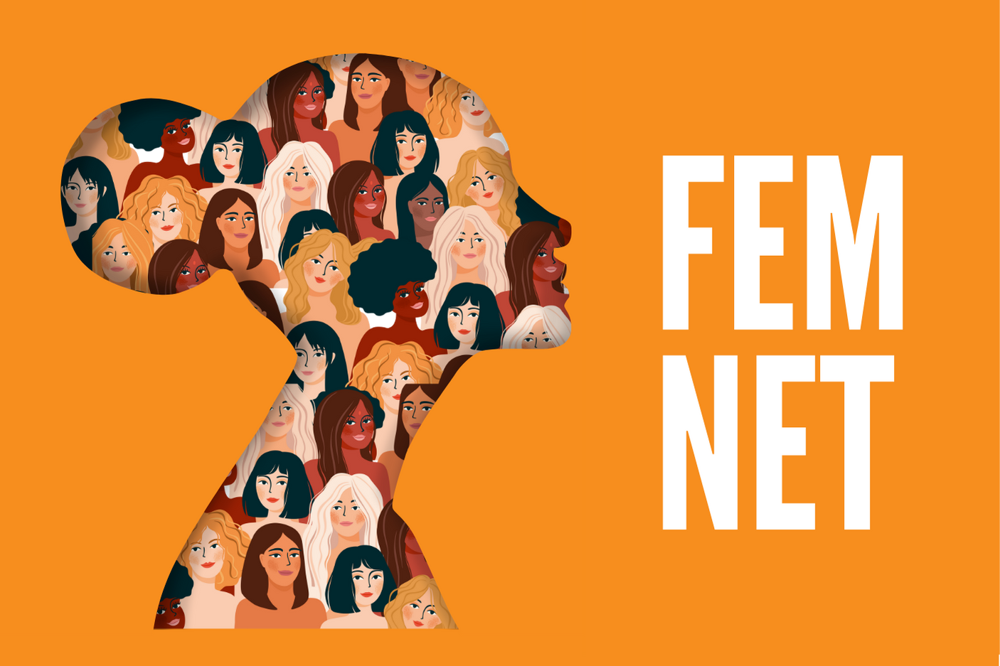

<!-- HERO -->

  

    <h1>PAN-TOGETHER</h1>
    
<strong>PAN</strong>créas, <strong>T</strong>umeurs <strong>O</strong>eso-<strong>G</strong>astriques <strong>E</strong>t <strong>T</strong>umeurs primitives <strong>HE</strong>pato-biliai<strong>R</strong>es   

    

      Réseau d’Excellence Clinique dédié aux cancers digestifs de mauvais pronostic
    

    

      Site en construction
    

  

---

## À propos du réseau

<strong>PAN-TOGETHER</strong> structure la prise en charge des cancers du pancréas, de l’œsophage,
de l’estomac, du foie et des voies biliaires afin d’améliorer la qualité et l’équité des soins
sur l’ensemble du territoire.

---

## Organisation

<!-- CARD CENTRALE -->

<h3>🏛️ Pilotage national</h3>

 <ul class="clean-list">
  <li>Pr Jean-Philippe Metges (CHU Brest)</li>
  <li>Pr Nathalie Ganne-Carrié (CHU Avicenne) </li>
</ul>

<!-- 3 CARDS EN DESSOUS -->

<h3> Axe Œsophage – Estomac – Jonction œso-gastrique </h3>

<ul class="clean-list">
<li>Pr Jean-Philippe Metges </li>
<li>Dr Vincent Bourbonne </li>
</ul>

  

<h3> Axe Foie et Voies Biliaires</h3>

 <ul class="clean-list">
<li>Pr Nathalie Ganne-Carrié </li>
<li>Pr Pierre Nahon </li>
</ul>

<h3> Axe Pancréas</h3>

 <ul class="clean-list">
<li>Pr Jean-Baptiste Bachet </li>
</ul>

---

## Centres experts

Le réseau regroupe **plus de 52 centres experts** en France et Outre-mer.

Ils assurent :
- accès aux essais cliniques innovants
- concertation pluridisciplinaire (RCP spécialisées)
- coordination ville–hôpital
- accès aux plateaux techniques de référence

👉 <a href="../cartes.html"><strong>Voir la cartographie des centres</strong></a>

---

## Missions

<h3>⚖️ Harmonisation des soins</h3>

Standardisation des pratiques sur le territoire national

<h3>⚡ Accélération des parcours</h3>

Réduction des délais de diagnostic et de traitement

<h3>🧪 Innovation thérapeutique</h3>

Accès élargi aux essais cliniques

<h3>🤝 Coordination multidisciplinaire</h3>

Prise en charge personnalisée du patient

  <h3>📢 Diffusion de l’information</h3>
  
Compréhension des pathologies et du parcours de soins

  <h3>🎓 Formation continue</h3>
  
Mise à jour des connaissances et des compétences des professionnels de santé 

---

## Vision

PAN-TOGETHER : améliorer ensemble le pronostic des cancers digestifs de mauvais pronostic

---

<!-- BANNER -->

  

  

    PAN-TOGETHER
  

  

    

    
  

